# PromptLab - Interactive Demo Walkthrough

> **Visual Demonstration of 'PromptLab' - AI-Assisted Full-Stack Application**  
> GitHub Copilot Course – Practical Assignment

---

## 📌 Quick Navigation

- [Application Overview](#application-overview)
- [User Journey](#user-journey)
  - [Step 1: Model Selection](#step-1-model-selection)
  - [Step 2: Prompt Lab (Main Interface)](#step-2-prompt-lab-main-interface)
  - [Step 3: About](#step-3-about)
  - [Step 4: Glossary](#step-4-glossary)
- [Key Features Showcase](#key-features-showcase)
- [Technical Architecture](#technical-architecture)
- [AI-Assisted Development Evidence](#ai-assisted-development-evidence)
- [Performance & Quality](#performance--quality)
- [Conclusion](#conclusion)

---

## Application Overview

**PromptLab** is a full-stack web application that enables users to interact with multiple LLM providers (Google Gemini, Groq), analyze token costs, view detailed execution metrics, and learn about AI/LLM concepts through interactive educational features.

**Technology Stack**:
- **Backend**: .NET 10, C# 15, Entity Framework Core 8, SQLite
- **Frontend**: Vue 3, TypeScript, Tailwind CSS v4, Vite
- **Architecture**: Clean Architecture (Core → Infrastructure → API)

**Development Achievement**: 98% of code implemented using GitHub Copilot and autonomous coding agents
---

## User Journey

### Step 1: Model Selection

**Purpose**: Users begin their journey by selecting an LLM provider and model

**Features Demonstrated**:
- **Provider Cards**: Visual display of available providers (Google Gemini, Groq)
- **Availability Status**: Real-time indication of provider availability with color-coded badges
- **Model Information**: List of available models for each provider
- **Dynamic Loading**: Models fetched from provider APIs (not hardcoded)
- **API Connection Monitoring**: Red warning banner appears if backend is unavailable
- **Professional Design**: Light theme with Godel Technologies blue color scheme

**User Actions**:
1. Application loads directly to Model Selection page
2. User views available providers with their status
3. User clicks on a provider card to see available models
4. User selects a specific model (e.g., gemini-1.5-flash, llama3-8b-8192)
5. User clicks "Continue" to proceed to Prompt Lab

<p align="center">
  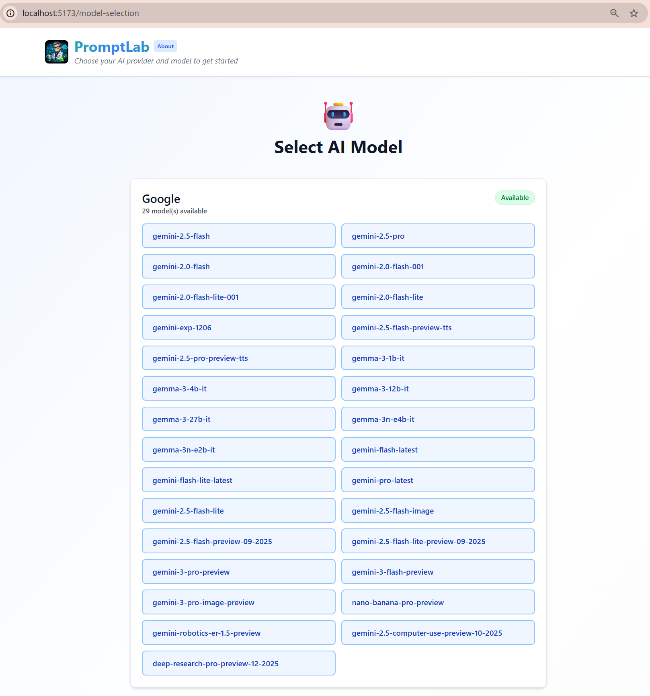<br>
  <em>Model Selection page showing Google Gemini and Groq provider cards with availability status</em>
</p>

<p align="center">
  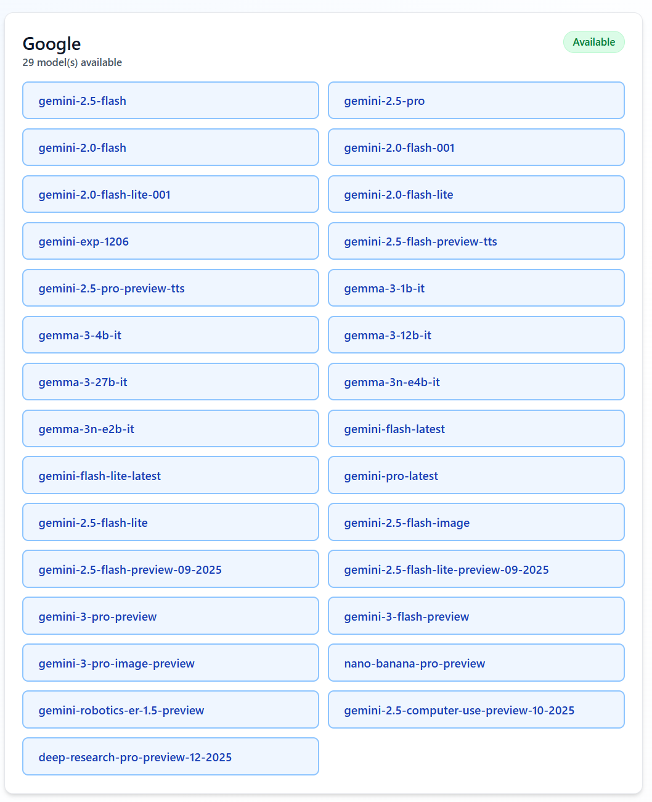<br>
  <em>Google Gemini provider expanded, displaying available models</em>
</p>

<p align="center">
  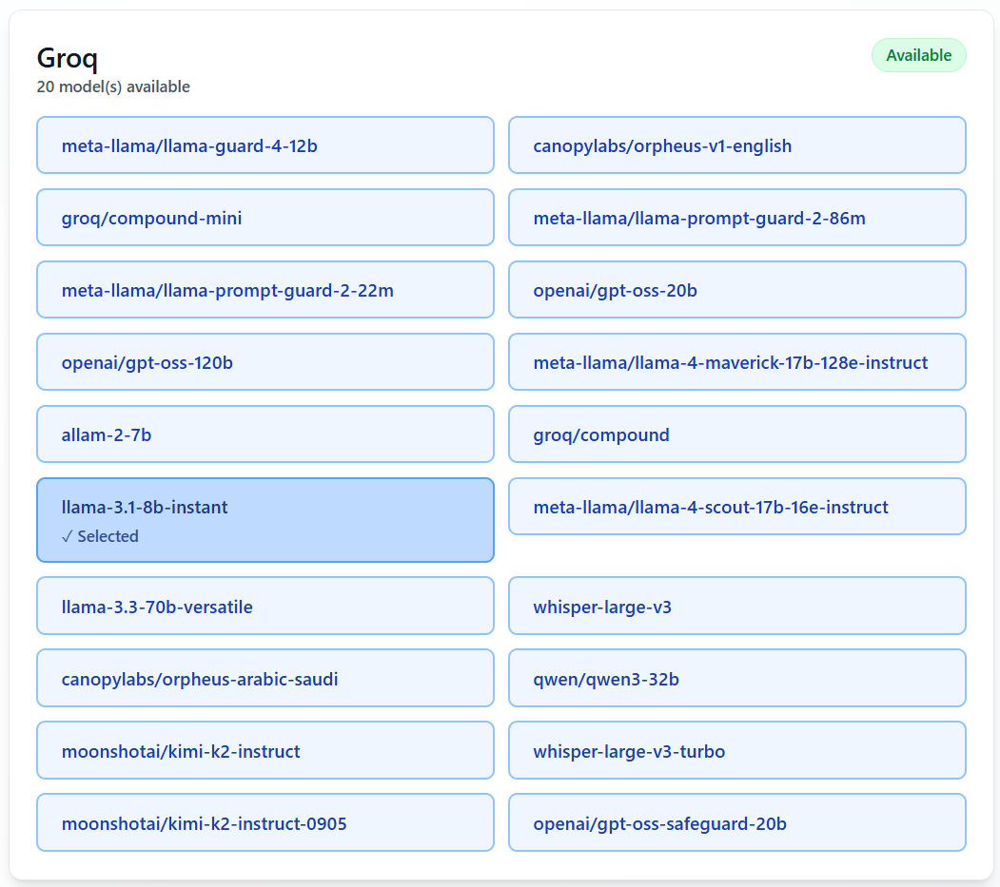<br>
  <em>Groq provider expanded, showing available models</em>
</p>

<p align="center">
  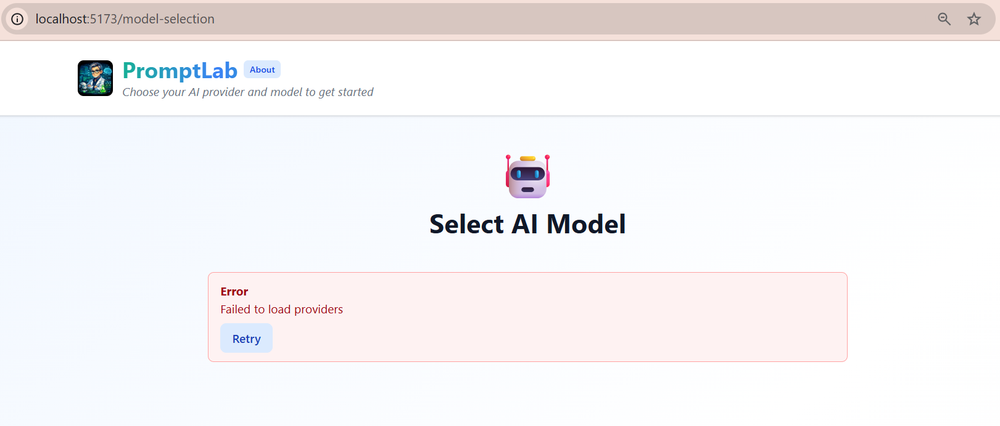<br>
  <em>Error state: Red warning banner displayed when backend API is unavailable</em>
</p>

### Step 2: Prompt Lab (Main Interface)

**Purpose**: The primary workspace where users craft prompts, execute LLM requests, and analyze results

#### Page Header
- **Logo & Title**: PromptLab with custom engineer mascot logo
- **Tagline**: "Where AI Prompts Come to Life"
- **Model Info**: Currently selected provider and model displayed on top right
- **Change Model Button**: Quick access to return to model selection

**Components**:

**Prompt Input Textarea**
   - Large text area for user prompt
   - Auto-resizing based on content
   - Disabled with overlay when API unavailable
   - Clear focus states with blue outline

**Action Buttons**
   - **Execute Prompt**: Primary action button (light blue)
   - **Clear History**: Secondary button to reset conversation
   - **Change Model**: Navigate back to model selection

**Response Block**:
- **Loading State**: Animated heartbeat icon with pulsing rings and gradient progress bar
- **Response Display**: Markdown-rendered AI response with syntax highlighting
- **Copy Button**: Copy response to clipboard
- **Clear Button**: Remove current response

**Metrics Dashboard**:
- **Total Tokens**: Input + Output token count
- **Estimated Cost**: Calculated cost in USD based on provider pricing
- **Avg Execution Time**: Average response time in seconds (with 2 decimal precision)

**Conversation History**:
- Expandable panel showing previous prompts and responses
- Maintains context for multi-turn conversations
- Clear visual separation between user prompts and AI responses

<p align="center">
  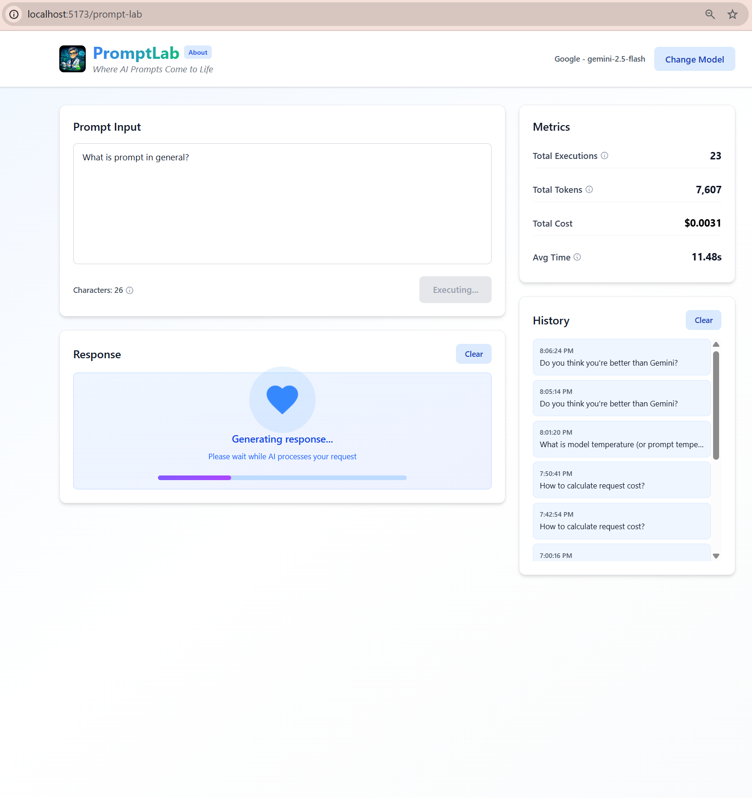<br>
  <em>Prompt Lab interface with animated loading state (heartbeat icon and progress bar) while AI generates response</em>
</p>

<p align="center">
  <br>
  <em>Completed execution showing markdown-rendered AI response with metrics (tokens, cost, latency)</em>
</p>

<p align="center">
  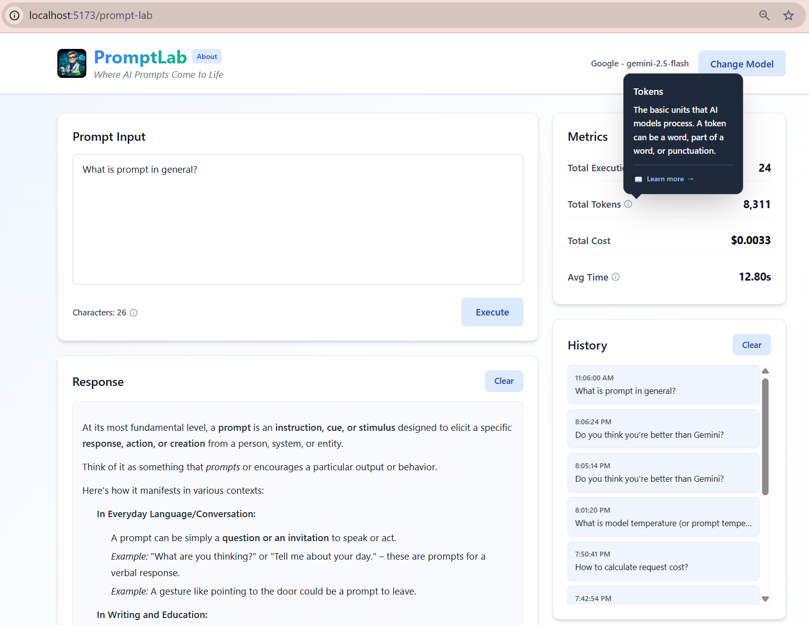<br>
  <em>Interactive tooltip displayed on hover, providing educational information about AI/LLM concepts</em>
</p>

<p align="center">
  <br>
  <em>Conversation history panel showing previous prompts and responses with context preservation</em>
</p>

#### API Connection Monitoring

**Red Warning Banner** (appears when backend unavailable):
- Clear message: "API connection unavailable"
- Troubleshooting tips:
  - Check if backend server is running (port 5251)
  - Verify API endpoint is accessible
  - Check network connectivity
- Automatic retry indicator: "Automatically checking connection every 15 seconds..."

<p align="center">
  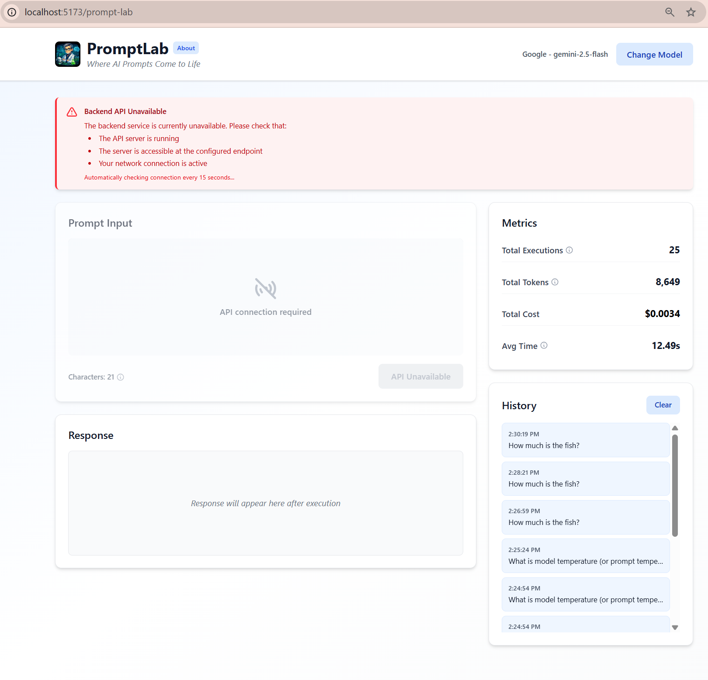<br>
  <em>UI disabled with warning banner when backend is unavailable - prompt input is overlaid with connection message</em>
</p>

#### Complete Workflow Example

**Scenario**: User asks about Python programming

1. User enters prompt: "Explain Python list comprehensions with examples"
2. Clicks "Execute Prompt"
3. Loading animation displays (heartbeat + progress bar)
4. Response appears with formatted code examples
5. Metrics update: 12 input tokens, 487 output tokens, $0.0015 cost, 2.34s execution time
6. User can ask follow-up questions maintaining conversation context


### Step 3: About

**Purpose**: Project information and technical details

**Content**:
- **Application Description**: Overview of PromptLab's purpose and capabilities
- **Version Information**: Current version
- **Technology Stack**: Backend and frontend technologies listed
- **GitHub Repository Link**: Direct link to source code
- **Development Context**: GitHub Copilot Course practical assignment
- **AI Assistance Disclosure**: 98% AI-generated code with link to conversation logs
- **Author Information**: Project creator details

<p align="center">
  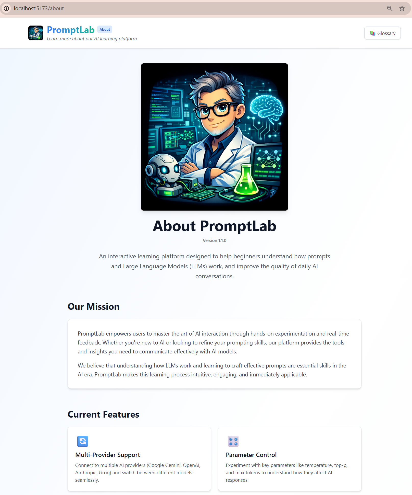<br>
  <em>About page header with application description, version 1.1.0, and GitHub Copilot Course context</em>
</p>

<p align="center">
  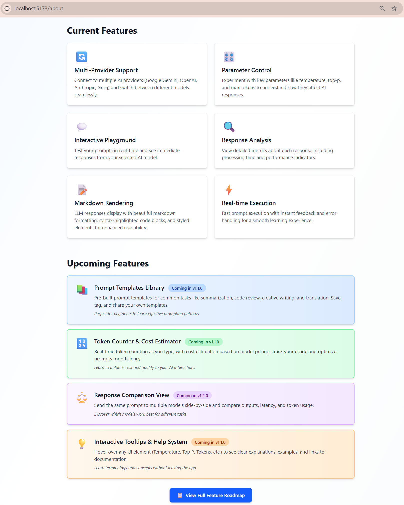<br>
  <em>Key features section listing multi-provider support, token counting, conversation history, and educational tooltips</em>
</p>

<p align="center">
  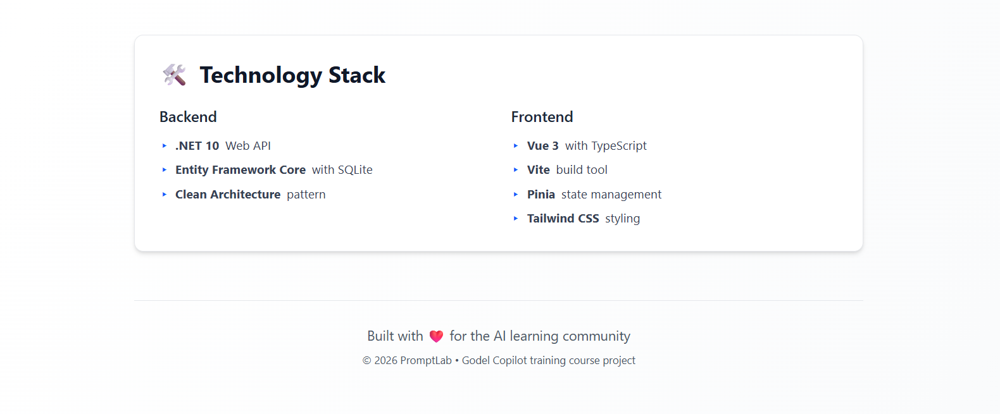<br>
  <em>Technology stack details and footer with repository link and author information</em>
</p>

### Step 4: Glossary

**Purpose**: Educational resource explaining AI/LLM terminology and concepts

**Features**:
- **Comprehensive Definitions**: 20+ terms explained in detail
- **Categorized Content**:
  - **Parameters**: Temperature, Top P, Max Tokens, Top K, Frequency/Presence Penalty
  - **Models**: Gemini-1.5-Flash, Gemini-1.5-Pro, Llama3-8b-8192, Mixtral-8x7b-32768
  - **Concepts**: Tokens, Context Window, Prompts, Streaming, Latency
- **Rich Descriptions**: Each term includes:
  - Clear definition
  - Practical examples
  - Best practices
  - Links to official documentation (Google, Groq)
- **Hash Navigation**: Direct links from tooltips (e.g., `/glossary#temperature`)
- **Professional Layout**: Clean card-based design with consistent spacing

**User Value**:
- Beginners learn AI/LLM fundamentals
- Quick reference during prompt crafting
- Bridges gap between UI controls and underlying concepts

<p align="center">
  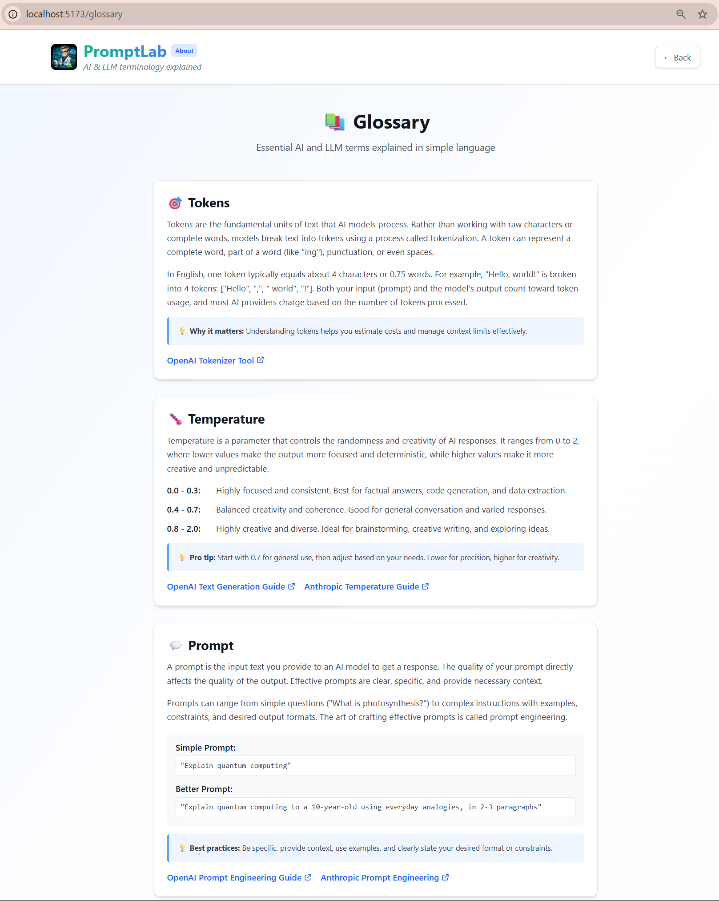<br>
  <em>Glossary page with categorized AI/LLM terminology: parameters, models, and concepts with detailed explanations</em>
</p>

## Key Features Showcase

### 1. Multi-Provider Support

**Capability**: Seamless integration with multiple LLM providers without vendor lock-in

**Architecture**:
- `ILlmProvider` interface abstraction layer
- Provider-specific implementations (GoogleGeminiProvider, GroqProvider)
- Extensible design supports adding new providers in the future

**User Benefit**: Compare responses from different providers and models

**Current Providers**: Google Gemini, Groq


### 2. Real-Time Token Counting & Cost Estimation

**Capability**: Calculate token usage and estimated cost before/after execution

**Implementation**:
- Token counting API integration
- Dynamic pricing based on provider and model
- Cumulative metrics across conversation

**User Benefit**: Budget-aware prompt engineering, understand LLM economics


### 3. Conversation History Management

**Capability**: Multi-turn conversations with context preservation

**Implementation**:
- SQLite database persistence
- Entity Framework Core for data access
- Conversation, Prompt, and Response entities

**User Benefit**: Build on previous context, refine ideas through dialogue


### 4. Educational Tooltip System

**Capability**: In-context learning support for AI/LLM concepts

**Implementation**:
- TypeScript configuration system (`tooltips.config.ts`)
- Reusable `AppTooltip.vue` component
- Smart positioning (top/bottom/left/right)
- Links to comprehensive glossary

**User Benefit**: Learn while using, reduce learning curve for beginners


### 5. Markdown Response Rendering

**Capability**: Beautiful formatting for code examples, tables, lists in AI responses

**Implementation**:
- `markdown-it` library integration
- Syntax highlighting for code blocks
- Proper rendering of headers, lists, tables, blockquotes

**User Benefit**: Improved readability, professional presentation of technical content


### 6. API Connection Monitoring

**Capability**: Graceful handling of backend unavailability

**Implementation**:
- Automatic health checks every 15 seconds
- Pinia store state management (`isApiConnected`)
- Disabled UI controls with clear messaging
- Red warning banners with troubleshooting tips

**User Benefit**: Clear system status, no confusing errors


### 7. Professional UI/UX Design

**Design System**:
- **Color Palette**: Godel Technologies blues (#3b82f6, #2563eb)
- **Light Theme**: Professional, accessible, high contrast
- **Unified Components**: Consistent button styling, card layouts
- **Smooth Animations**: GSAP-powered transitions, heartbeat loading states
- **Responsive Layout**: Works on desktop and tablet sizes

## Technical Architecture

### Backend Architecture

**Pattern**: Clean Architecture with clear separation of concerns

```
src/PromptLab.Core/           # Domain entities, interfaces, DTOs
    ├── Domain/               # Conversation, Prompt, Response
    ├── DTOs/                 # Data transfer objects
    ├── Providers/            # ILlmProvider interface
    └── Configuration/        # Provider settings

src/PromptLab.Infrastructure/ # Implementation of interfaces
    ├── Services/             # Business logic services
    ├── Repositories/         # Data access
    └── Providers/            # LLM provider implementations

src/PromptLab.Api/            # Presentation layer
    ├── Controllers/          # REST API endpoints
    ├── Middleware/           # Rate limiting, logging
    └── Filters/              # Global exception handling
```

**Key Services**:
1. **Request Preparation Service**: Validation, history loading, context enrichment
2. **LLM Execution Service**: Provider routing and invocation
3. **Prompt Persistence Service**: Database operations, conversation management

---

### Frontend Architecture

**Pattern**: Vue 3 Composition API with centralized state management

```
client/src/
    ├── views/                # Page components
    │   ├── HomeView.vue      # Redirects to model selection
    │   ├── ModelSelectionView.vue
    │   ├── PromptLabView.vue # Main interface
    │   ├── GlossaryView.vue
    │   └── AboutView.vue
    ├── components/           # Reusable components
    │   ├── InputBlock.vue
    │   ├── OutputBlock.vue
    │   ├── MetricsCard.vue
    │   └── AppTooltip.vue
    ├── stores/               # Pinia state management
    │   ├── llmStore.ts       # Provider/model state
    │   ├── promptStore.ts    # Prompt/response state
    │   └── metricsStore.ts   # Metrics tracking
    ├── services/             # API communication
    │   └── apiService.ts     # Axios HTTP client
    └── config/               # Application configuration
        └── tooltips/         # Tooltip definitions
```
---

### API Documentation

**Swagger/OpenAPI Integration**:
- Interactive API documentation at `/swagger`
- All endpoints documented with request/response schemas
- Try-it-out functionality for testing

**Key Endpoints**:
- `GET /api/Providers` - List all providers with availability
- `GET /api/Providers/{provider}/models` - Get models for provider
- `POST /api/Prompts/execute` - Execute prompt and return response
- `GET /api/Health` - Application health check

**Screenshot Placeholders**:
- [ ] Swagger UI overview
- [ ] Example endpoint documentation
- [ ] Try-it-out feature

---

### Database Schema

**SQLite Database** (development) with Entity Framework Core

**Entities**:
```sql
Conversations
    - Id (PK)
    - UserId
    - CreatedAt
    - UpdatedAt

Prompts
    - Id (PK)
    - ConversationId (FK)
    - PromptText
    - SystemPrompt
    - Provider
    - Model
    - Parameters (JSON)
    - CreatedAt

Responses
    - Id (PK)
    - PromptId (FK)
    - Content
    - InputTokens
    - OutputTokens
    - Cost
    - LatencyMs
    - CreatedAt
```
---

## AI-Assisted Development Evidence

### GitHub Copilot Usage: 98%

This project demonstrates advanced AI-assisted development capabilities:

---

### 1. Autonomous Coding Agents

**6 Backend Tasks Fully Implemented by GitHub Copilot Coding Agent**:
- LLM Provider Abstraction Layer (Issue #3)
- Google Gemini API Client (Issue #5)
- Rate Limiting Service (Issue #7)
- Prompt Execution Service (Issue #6)
- API Controllers (Issue #9)
- Configuration-Based Provider Service (Issue #32)

**Process**:
1. Detailed GitHub issue created with acceptance criteria
2. Issue assigned to GitHub Copilot agent
3. Agent autonomously:
   - Created feature branch
   - Implemented code across multiple files
   - Wrote tests
   - Opened pull request with comprehensive description
4. Human review and merge

**Screenshot Placeholders**:
- [ ] GitHub issue assigned to Copilot agent
- [ ] Copilot-generated PR with full description
- [ ] PR showing multi-file implementation
- [ ] Merged PR with commit history

---

### 2. Copilot Inline Suggestions

**Frontend Component Generation**:
- Complete Vue components generated from prompts
- TypeScript type definitions
- Pinia store implementations
- Tailwind CSS styling
---

### 3. AI Conversation Logs

**Complete Development Transparency**:
- 13 detailed conversation logs documenting every session
- Each log includes:
  - Session overview
  - Key decisions made
  - Complete conversation transcript
  - Technical challenges and solutions
  - Learning outcomes

**Consolidated Documentation**:
- [Project Recap](ai-conversations/project-recap.md): Complete project journey
- [Lessons Learned](ai-conversations/lessons-learned.md): Practical AI development insights

**Screenshot Placeholders**:
- [ ] AI conversation logs directory
- [ ] Example conversation log content
- [ ] Project recap document excerpt

---

### 4. Task Documentation

**23 Comprehensive Task Descriptions**:
- Aligned with all 27 GitHub Issues
- Organized in 6 implementation phases
- Each includes: Status, Priority, Effort, Objective, Requirements, Acceptance Criteria

 [Tasks](tasks/README.md): Practical AI development insights
---

### 5. Pull Request Quality

**AI-Generated PRs Include**:
- Descriptive titles following conventional commits (feat:, fix:, refactor:)
- Comprehensive descriptions explaining changes
- Links to related issues
- Technical implementation details
- Testing instructions

---

## Performance & Quality

### Metrics

**Development Speed**:
- Traditional estimate: 4-6 weeks
- Actual delivery: 10 days
- **Speed multiplier**: 3-4x faster

**Code Volume**:
- Backend: ~5,000 lines (.NET services, controllers, infrastructure)
- Frontend: ~3,000 lines (Vue components, stores, services)
- Tests: ~1,500 lines (integration tests)
- Configuration: ~500 lines
- **Total**: ~10,000 lines in 10 days

**Quality Metrics**:
- **Issues**: 27 total (25 closed, 2 open)
- **Pull Requests**: 25+ merged
- **Task Completion**: 22 of 23 (95.7%)
- **Test Coverage**: 22 integration tests with mocked HTTP
- **Major Bugs**: 5 encountered and resolved (enum mismatch, timeouts, styling issues)

---

### Code Quality Examples

**Clean Architecture Adherence**:
- Clear separation between Core, Infrastructure, and API layers
- Dependency injection throughout
- SOLID principles applied

**Type Safety**:
- TypeScript strict mode in frontend
- C# nullable reference types in backend
- No `any` types in production code

**Error Handling**:
- Global exception filter for consistent API responses
- Graceful degradation when backend unavailable
- User-friendly error messages with troubleshooting tips

---

### Performance Optimizations

**Backend**:
- Parallel provider model fetching with `Task.WhenAll`
- Rate limiting middleware (60 requests/min, 1000/hour)
- Efficient database queries with EF Core

**Frontend**:
- Vite build optimization
- Lazy component loading
- Axios timeout configuration (60 seconds)
- Efficient state management with Pinia

---

## Repository Structure

```
ghc-promt-lab/
├── src/
│   ├── PromptLab.Api/           # Web API project
│   ├── PromptLab.Core/          # Domain layer
│   ├── PromptLab.Infrastructure/ # Data access layer
│   └── PromptLab.Tests/         # Test project
├── client/                      # Vue 3 frontend
│   ├── src/
│   │   ├── views/
│   │   ├── components/
│   │   ├── stores/
│   │   └── services/
│   └── public/
├── docs/                        # Documentation
│   ├── ai-conversations/        # AI session logs
│   │   ├── project-recap.md
│   │   └── lessons-learned.md
│   ├── tasks/                   # Task descriptions
│   ├── DEMO_WALKTHROUGH.md      # This document
│   └── *.md                     # Technical docs
├── .github/
│   └── instructions/            # AI coding guidelines
├── README.md                    # Main project documentation
└── PromptLab.slnx              # Solution file
```

---

## Conclusion

PromptLab demonstrates that **complex, production-quality applications can be built primarily with AI assistance** when guided by experienced engineering judgment. The combination of GitHub Copilot inline suggestions and autonomous coding agents enabled delivery of a full-stack application in 10 days—a timeline that traditionally requires 4-6 weeks.

**Key Achievements**:
- ✅ Complete full-stack application with modern tech stack
- ✅ Multi-provider LLM integration with clean abstraction
- ✅ Professional UI/UX with educational features
- ✅ Comprehensive documentation and transparency
- ✅ Real-world architectural patterns and best practices

**For Training Program**: This project serves as a practical blueprint for AI-assisted development, demonstrating both the capabilities and limitations of AI coding tools in professional software development.
---

**Document Version**: 1.0  
**Last Updated**: February 9, 2026  
**Prepared for**: GitHub Copilot Course – AI Adoption Program Practical Assessment
